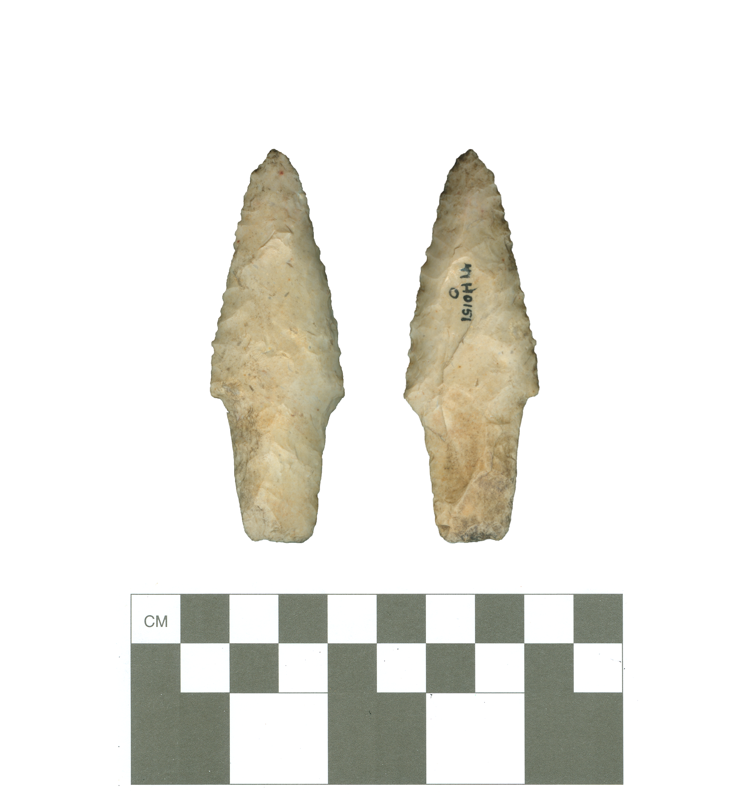

# Git-to-the-Point: Learn Git and Contribute to Texas Archaeology

Contributors: Robert Z. Selden, Jr.; Juanita D. Garcia; and David Foxe

Diagnostic artifacts comprise the basis for archaeological interpretations; however, as our taxonomic definitions evolve, artifacts that were previously assigned to a type generally retain that designation, potentially confounding future research efforts and interpretations. For this exercise, the original type assignments are made available in an editable format that fosters engagement with the basic principles of open science and reproducibility. Through the enlistment of Git, GitHub, and an open call to revise projectile point types&mdash;and their associated attributes&mdash;for specimens found across the National Forests and Grasslands in Texas (NFGT), the current catalog of projectile points and their most recent type assignments and attributes are made available to a general audience. This approach holds promise for historical and archaeological collections throughout a variety of research domains, and as a snowy/rainy-day option for outdoor outreach and citizen-science projects.

We encourage users unfamiliar with Git and GitHub to either work through the Git-it challenges to get started in the command line (http://jlord.us/git-it/) or review the content at http://happygitwithr.com/ to get started in R or RStudio.

This project is digitally curated on the Open Science Framework, and can be cited using the DOI: [10.17605/OSF.IO/VFPWH](https://osf.io/vfpwh/).

## Contributing

Contributions are welcomed from everyone. If you would like to contribute to this project, please begin by reading the [Guide to Contributing](CONTRIBUTING.md). Please note that this project is released with a [Contributor Code of Conduct](CONDUCT.md). By participating in this project you agree to abide by its terms.

## Acknowledgments

This project was developed in collaboration with archaeologists at the National Forests and Grasslands in Texas. Funding for this project was provided by a grant to Robert Z. Selden, Jr. from the National Forests and Grasslands in Texas (15-PA-11081300-033).
