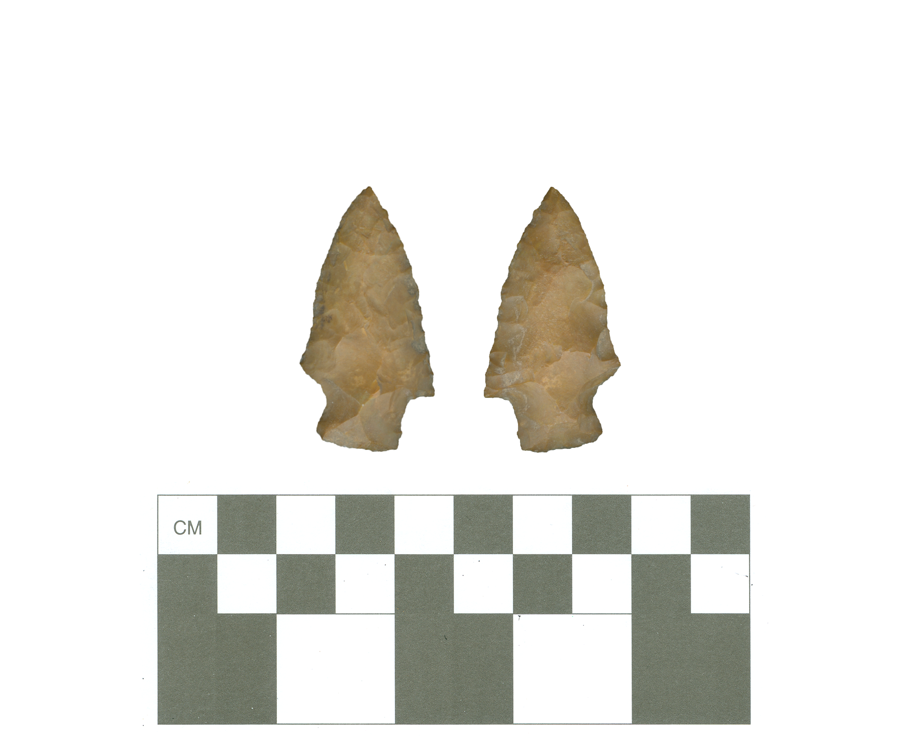

# 41AG132-surface

No artifact concentrations or features were located at 41AG132, leading surveyors to conclude that it may be representative of episodic occupations linked with raw material procurement, hunting, or camping. It was also noted that the historic artifacts present at this site may be from dumping along gullies and ditches. The extent of the site remains unknown, and natural impacts include progressive erosion along road ditches and cut banks.

A single Woodland period Kent point has been recovered from the surface of 41AG132. The dart point is made from a yellowish-brown chert, and is 43.9mm in length, 23.4mm in width, and 6.7mm in thickness. Stem width is 13.4mm.

