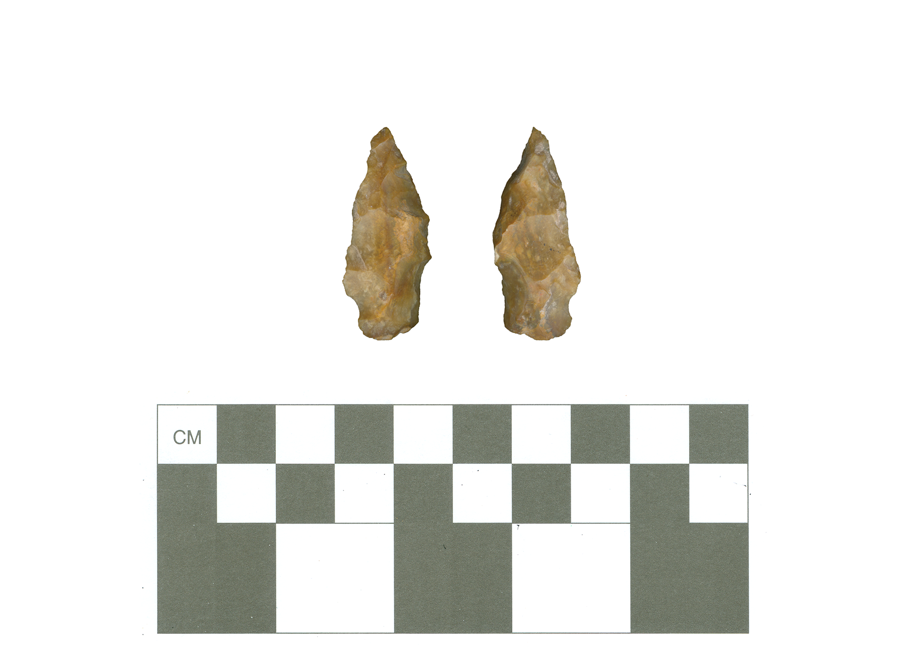

# 41HO73-TP1-50-60cm

A single Goose Creek Plain _var. unspecified_ body sherd was recovered in Unit 1 (70-80cmbs) at 41HO73, and this brown chert Kent dart point was found between 50-60cmbs in the same unit. These artifacts are indicative of a Woodland period occupation at the site.

