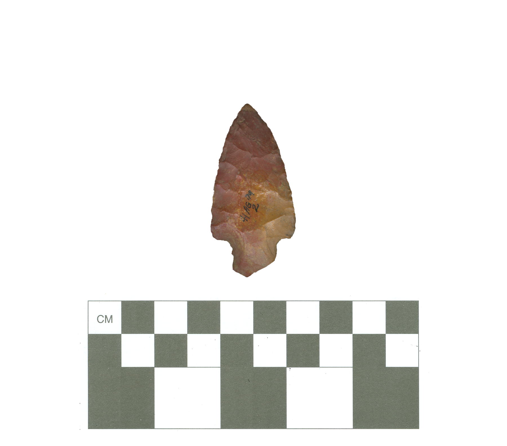

# 41AG79-Point1

Located on a knoll, the full extent of this site remains undetermined. During the 1995 survey, it was noted that the densest concentrations of lithic debris occurred on the easternmost area of the site, and was dominated by petrified wood and local cherts. In addition to the lithic debris, sandy paste sherds were also noted throughout the site; although sparse in number. It is unknown how much of this site remains intact, and testing was recommended for soils within the tree line to determine site boundaries.

This site was occupied during both Late Archaic and Early Caddo periods, based on the recovery of temporally diagnostic artifacts from the site surface. The earlier component included this Yarbrough dart point made from a local reddish-brown chert. The Early Caddo period component has a reddish-brown silicified wood [Alba arrow point](../alba/41AG79-Point1.md).

