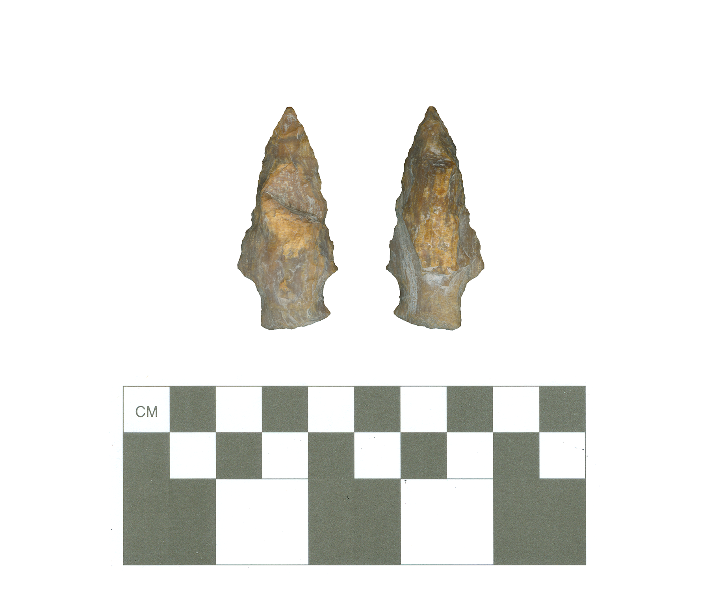

# 41HO72-Point2

The first temporally-distinct component at 41HO72 dates to the Late Archaic period and includes two petrified wood Yarbrough dart points (see the other point [here](41HO72-Point1.md)). Other chipped stone tools that may be part of this component are five petrified wood unifacial gouges. There is also a Woodland period component at 41HO72, represented by three sandy paste Goose Creek Plain _var. unspecified_ body sherds.

