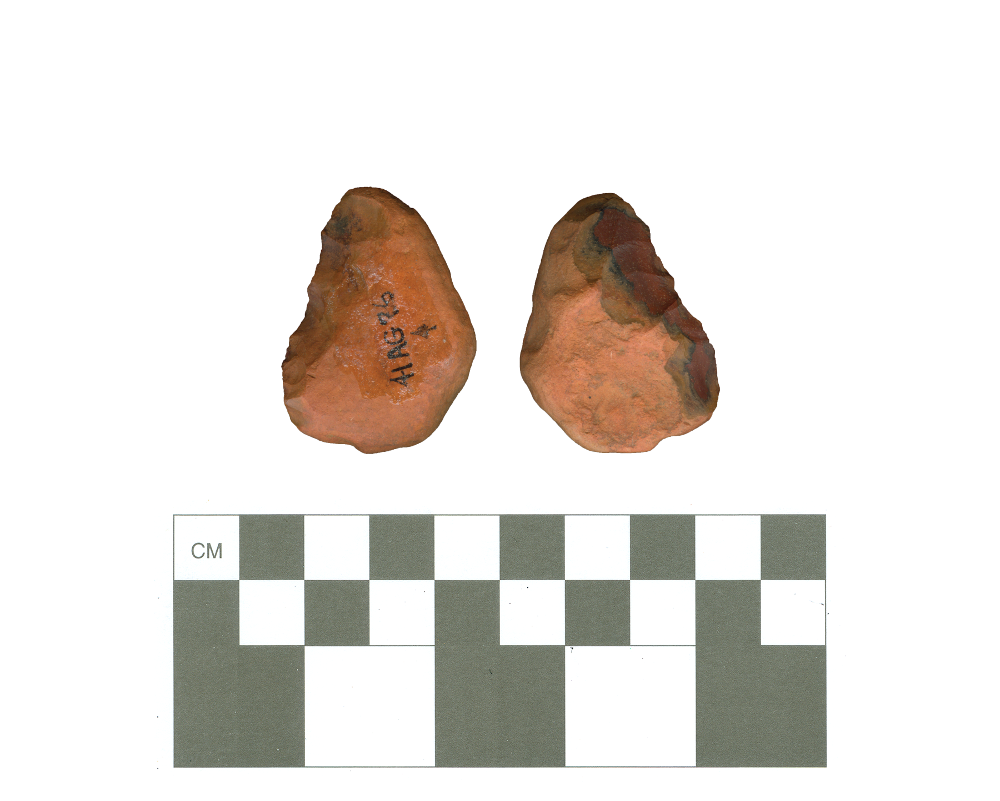

# 41AG76-Lot4

This site includes a Woodland period component. Found in surface contexts at the site are 18 Goose Creek Plain _var. unspecified_ sherds, including one rim sherd with a direct rim and a rounded lip, and one plain bone-tempered body sherd. Chipped stone tools probably associated with this component include this side scraper of red chert, two petrified wood biface fragments, and a petrified wood bilateral flake tool.

