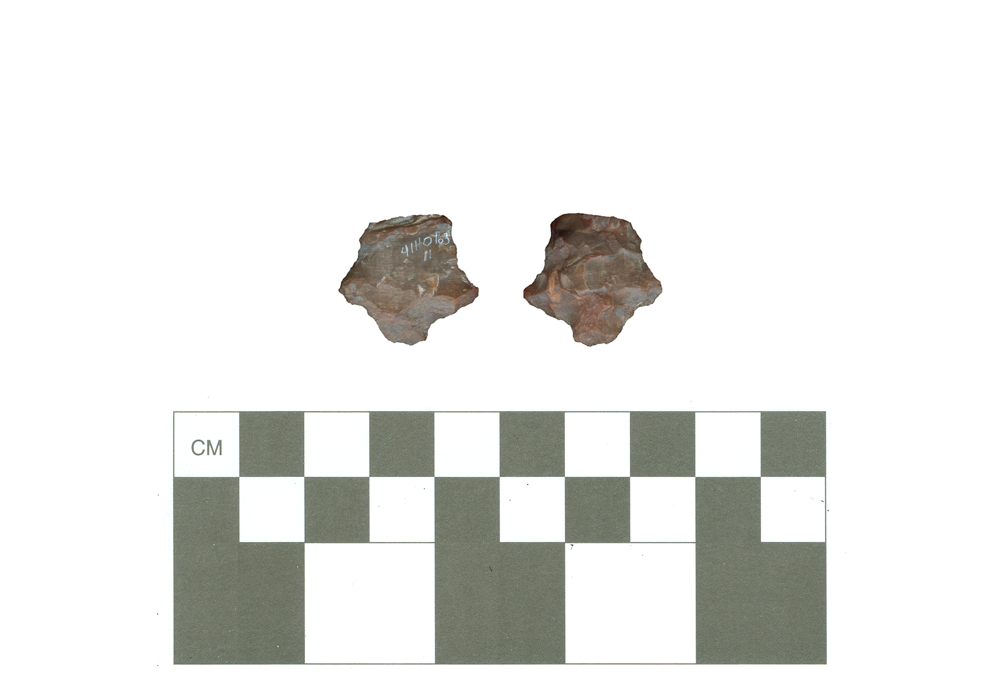

# 41HO163-Lot11

The artifacts recovered from 41HO163 suggest it was likely occupied during the Woodland period. They include this unidentified silicified wood arrow point fragment (4.2 mm in thickness), and a silicified wood biface tip. Also found at the site were three body sherds and one plain rim sherd with a direct profile and a rounded lip, which were assigned to the Goose Creek Plain _var. unspecified_ type.

