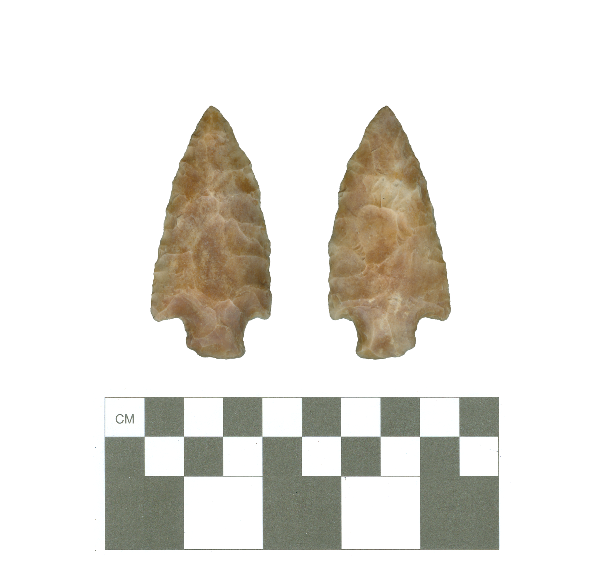

# 01SB102-3-Point2

This projectile point is not assigned to a type. It was found in Sabine County, Texas on the Sabine National Forest. No additional provenience information is known for this projectile.

